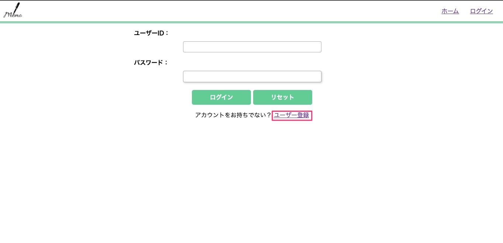
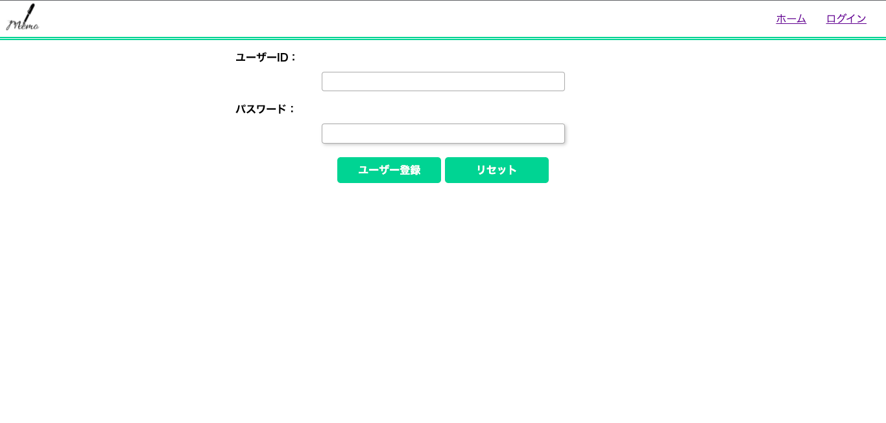
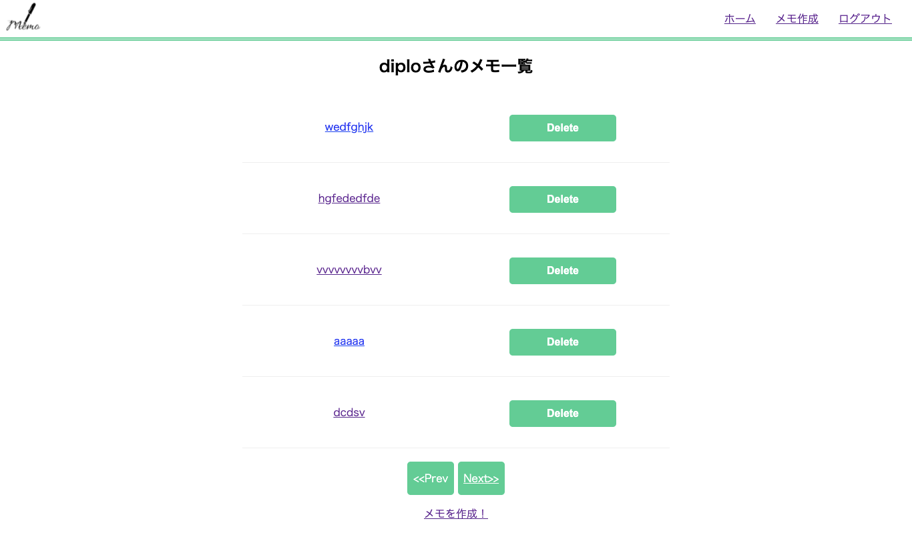
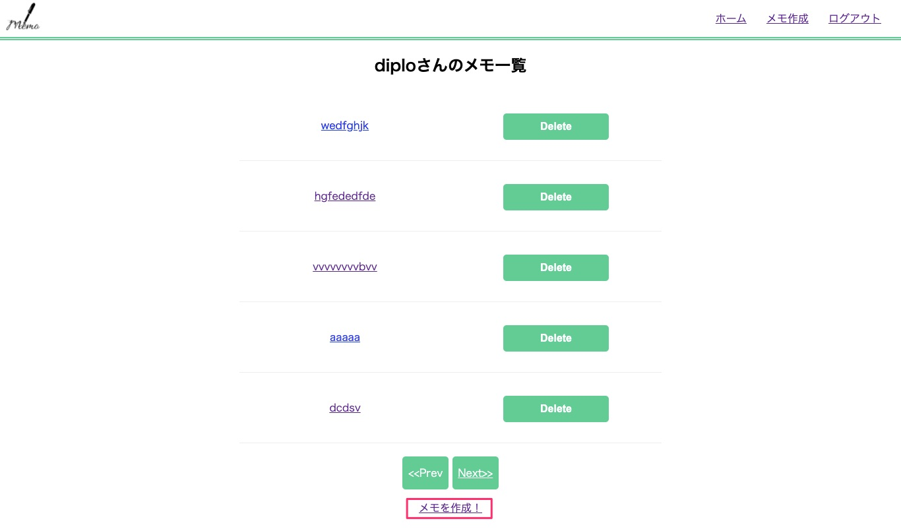
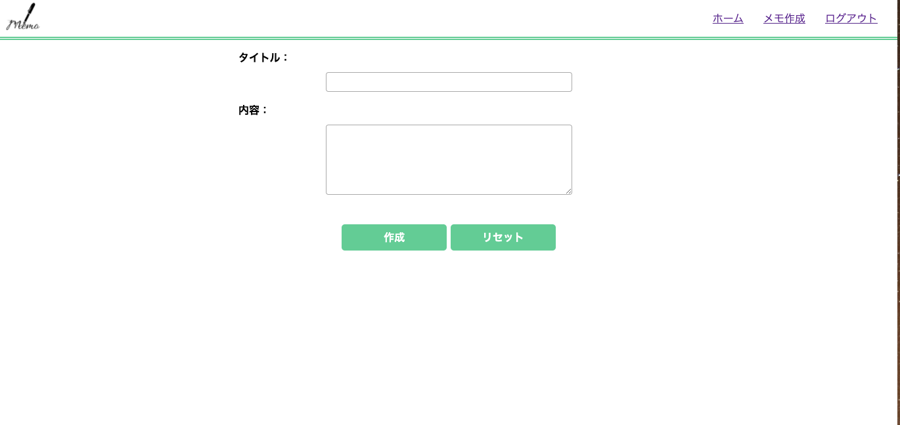
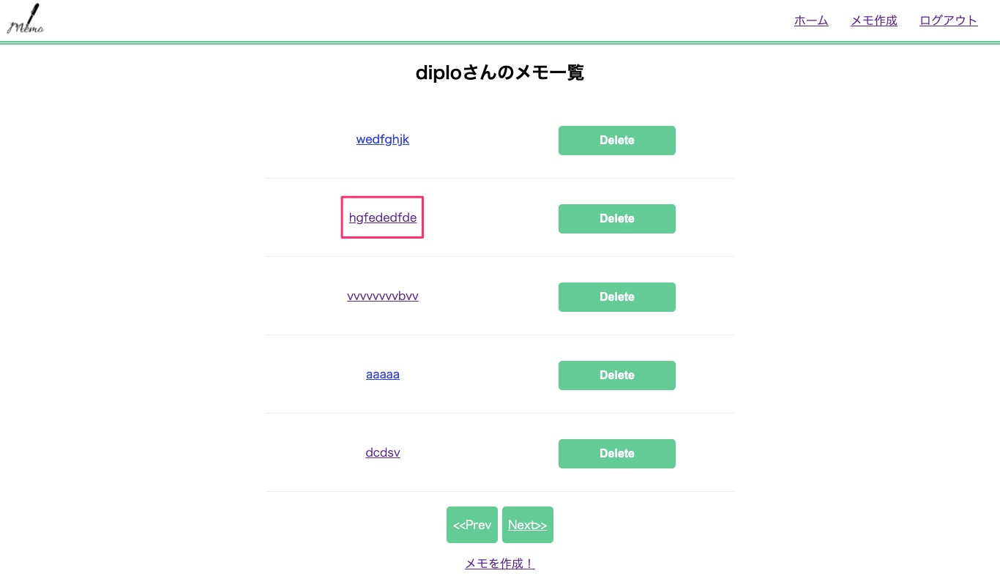
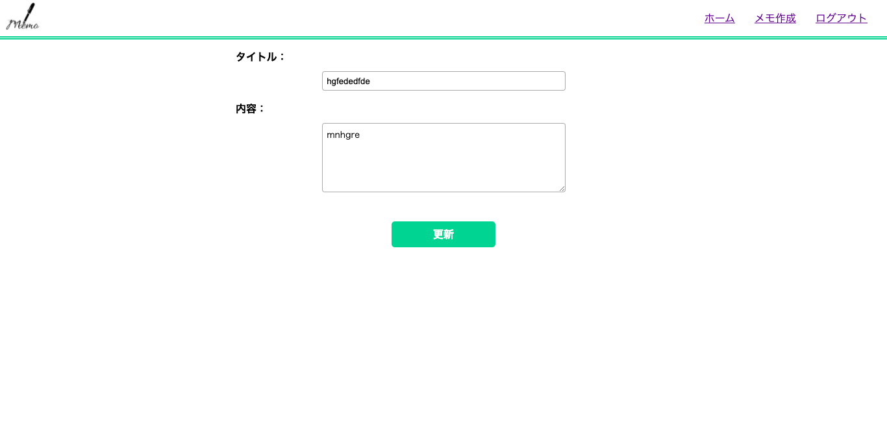
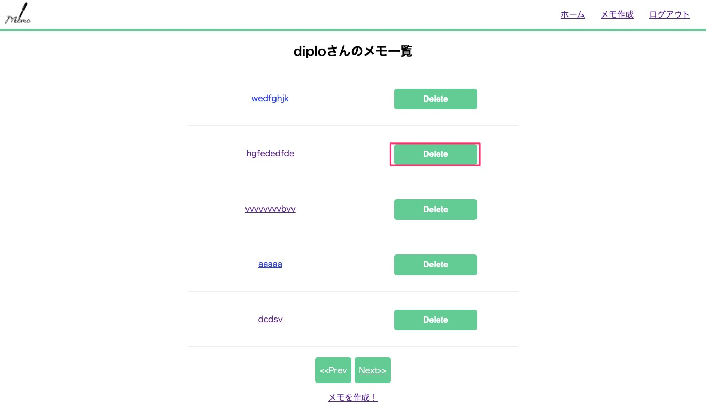

# Memo-app
簡単なメモを作成、管理できるアプリです。

## How to Use
1. ご自分のPCのコマンドスクリプトを開き、インストールしたフォルダまで移動してください。
2. 以下のコマンドでGemをインストールしてください。
```
bundle install
```
3.  以下のコマンドでDBの初期設定を行ってください。
```
sqlite3 memo.db < dbinit.sq3;
```

4. 以下のコマンドでアプリを起動させてください。
```
bundle exec ruby memo.rb
```

5. ユーザーの登録を行いましょう。
ログイン"画面下の"ユーザー登録"をクリックしてください。
  


6. ご自分のお好きなユーザーIDとパスワードを入力しユーザー登録ボタンを押してください。
  


7. ログインボタンで登録したユーザーIDとパスワードを入力すればメモアプリを使うことができます。さあ、はじめましょう！


## 基本的な機能紹介

### ホーム画面（メモ一覧画面）
この画面では作成されたメモが新しいものから順番に表示されます。
  


### メモ作成画面
ホームページのメモ一覧の下の”メモを作成！”をクリックすると以下の画面が表示されます。
  

メモのタイトルとメモしたい内容を入力し作成ボタンを押すと一覧にメモが表示されます。
  


### メモ編集画面
ホームページで編集したいメモをクリックします。
  

メモのタイトルと内容がそれぞれ入力された状態になっているので、
内容を変更し、更新ボタンを押してください。タイトルや内容が書き換えられます。
  


### メモ削除
ホームページ右のDeleteボタンを押すことでメモを削除することができます。
  
