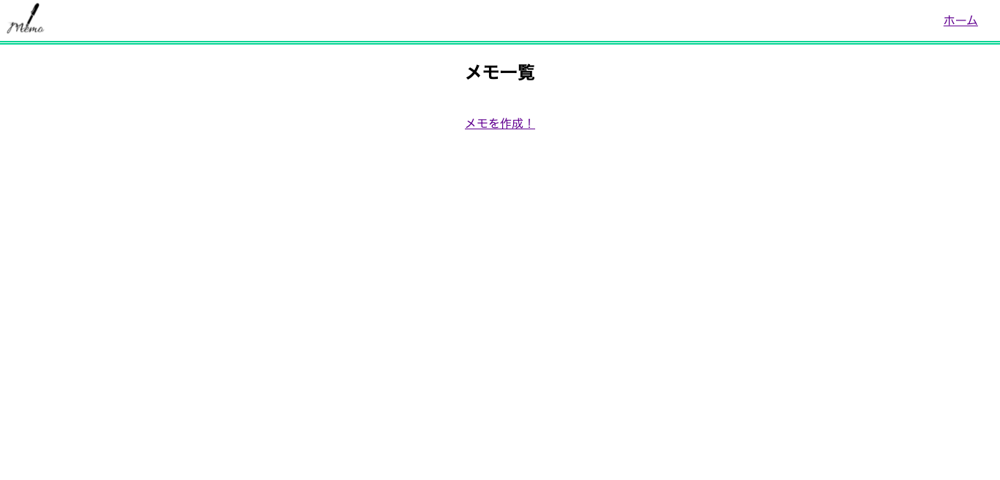
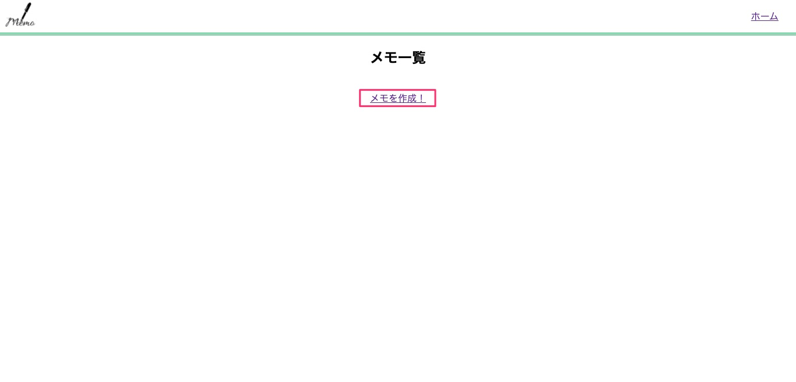
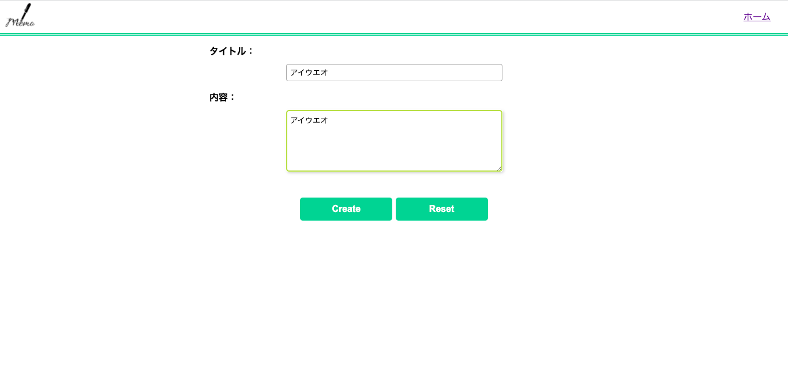
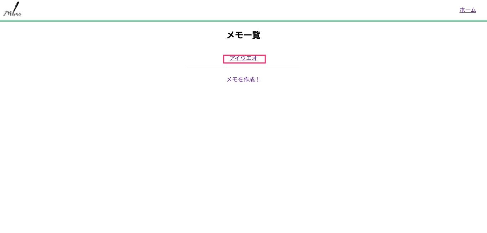
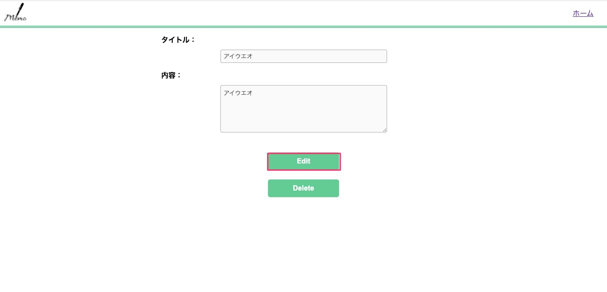
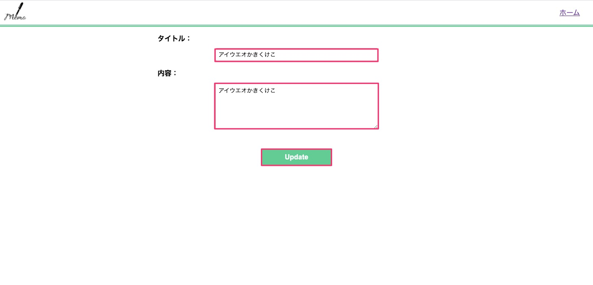
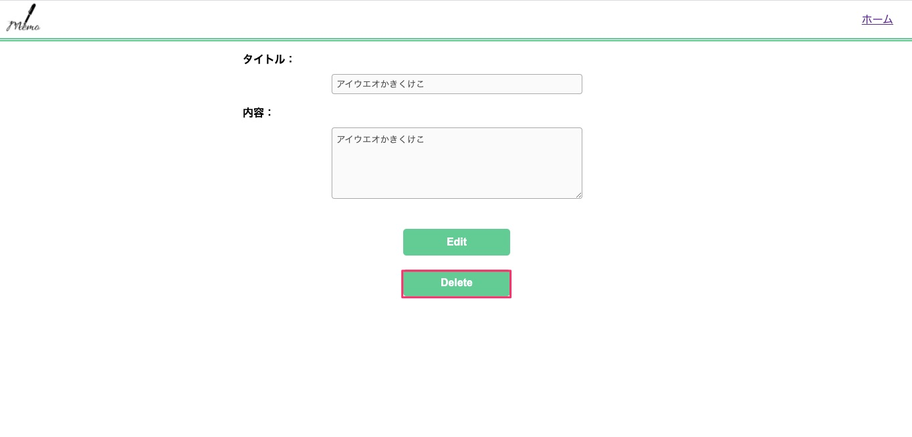

# Memo-app
簡単なメモを作成、管理できるアプリです。

## How to Use
1. ご自分のPCのコマンドスクリプトを開き、インストールしたフォルダまで移動してください。
2. 以下のコマンドでGemをインストールしてください。
```
bundle install
```
3. 以下のコマンドでアプリを起動させてください。
```
bundle exec ruby memo.rb
```

## 基本的な機能紹介

### ホーム画面（メモ一覧画面）
この画面では作成されたメモが表示されます。
  


### メモ作成画面
ホームページのメモ一覧の下の”メモを作成！”をクリックすると以下の画面が表示されます。
  


メモのタイトルとメモしたい内容を入力しCreateボタンを押すと一覧にメモが表示されます。
  


### メモ編集画面
ホームページで編集したいメモをクリックします。
  

メモのタイトルと内容の詳細が表示されます。Editボタンを押してください。
  


メモのタイトルと内容がそれぞれ入力された状態になっているので、
内容を変更し、Updateボタンを押してください。タイトルや内容が書き換えられます。
  


### メモ削除
ホームページで削除したいメモをクリックします。
  

メモのタイトルと内容の詳細が表示されます。Deleteボタンを押してください。
  

